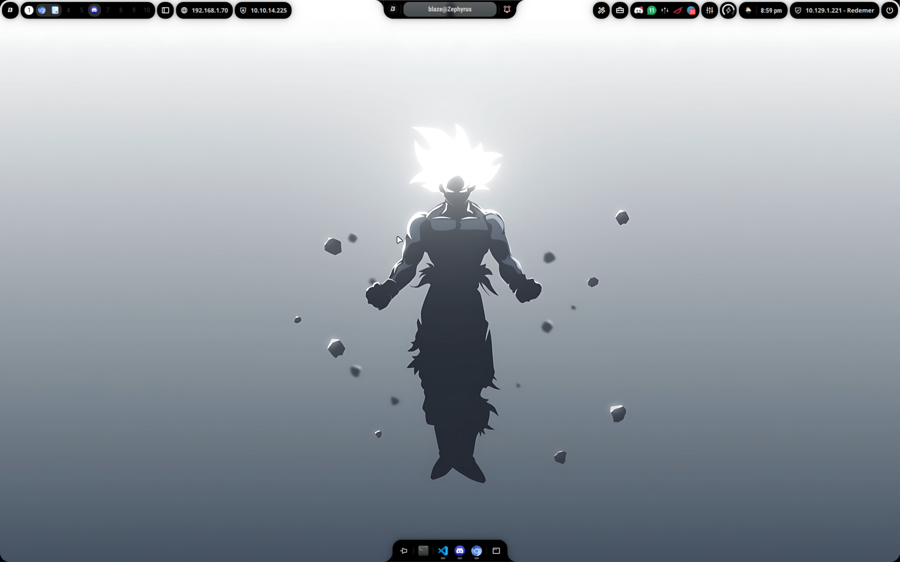
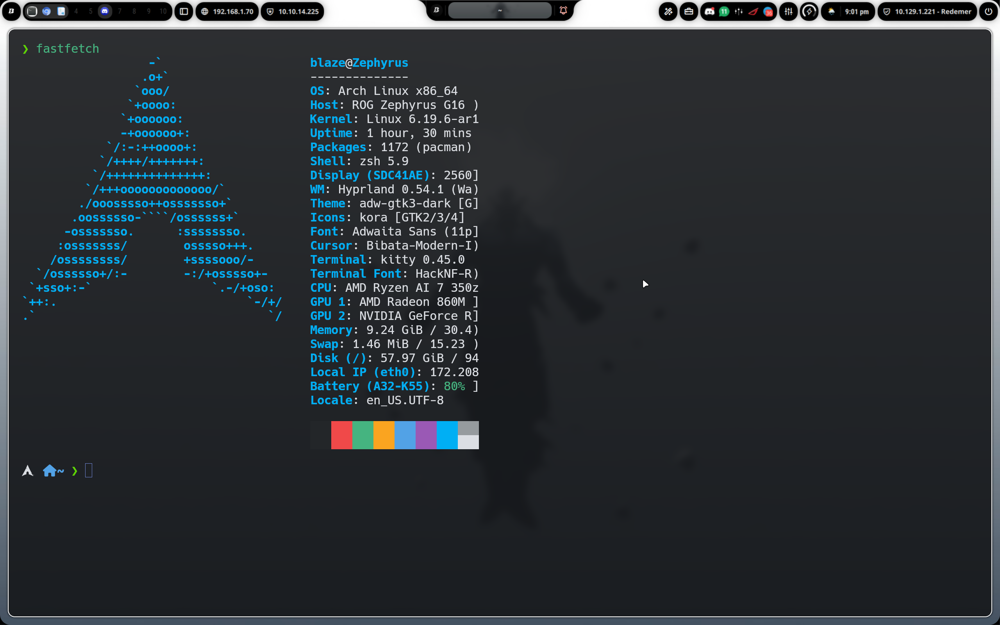
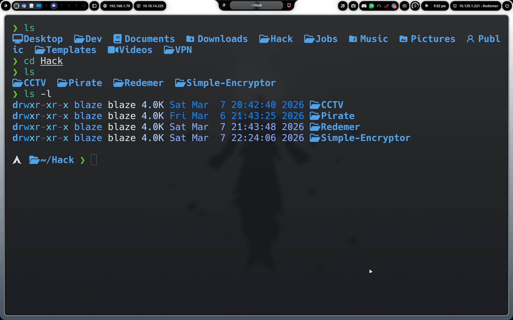
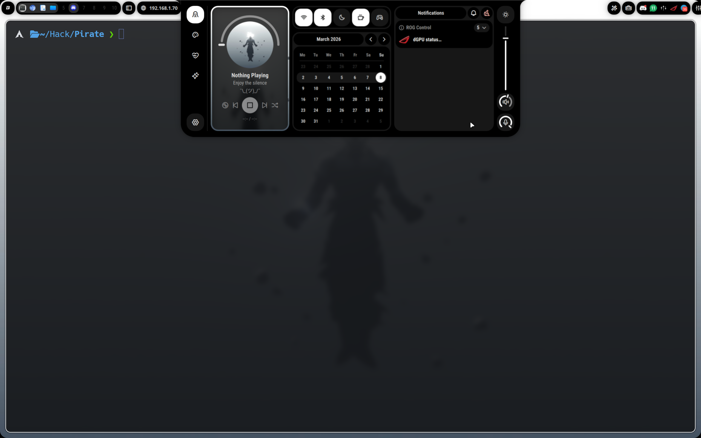

<div align="center">
  
  <h1> blaze dotfiles</h1>
  <p>Hyprland + Kitty + Zsh + Powerlevel10k + lsd + fonts, icons y wallpapers.</p>
  <p><a href="https://blazepwn.com/">blazepwn.com</a> · UI shell with <a href="https://github.com/Axenide/Ambxst">Ambxst</a></p>
</div>

##  Preview

<p align="center">
  
  
</p>

<p align="center">
  
  
</p>

##  Install (Arch)

```bash
sudo pacman -S --needed hyprland kitty zsh lsd grim slurp wl-clipboard imagemagick libnotify brightnessctl playerctl nwg-look hyprpicker swww hyprpolkitagent pipewire pipewire-pulse wireplumber glib2 dbus file bat fzf zsh-syntax-highlighting zsh-autosuggestions qt5ct qt6ct firefox chromium nautilus scrcpy flatpak telegram-desktop mission-center
yay -S --needed discord-canary asusctl rog-control-center visual-studio-code-bin bibata-cursor-theme-bin
git clone --depth=1 https://github.com/romkatv/powerlevel10k.git ~/.powerlevel10k
curl -L get.axeni.de/ambxst | sh
```

##  Plugins

- `zsh-syntax-highlighting`
- `zsh-autosuggestions`
- `sudo.plugin.zsh`

##  Paths

- `.config/hypr` -> `~/.config/hypr`
- `.config/kitty` -> `~/.config/kitty`
- `.config/lsd` -> `~/.config/lsd`
- `.zshrc` -> `~/.zshrc`
- `.p10k.zsh` -> `~/.p10k.zsh`
- `.icons` -> `~/.icons`
- `.fonts` -> `~/.fonts`
- `Pictures/Wallpapers` -> `~/Pictures/Wallpapers`
- `Pictures/Examples` -> `~/Pictures/Examples`
- `~/.powerlevel10k`
- `~/.config/ambxst`

##  Notes

- `Kora` icons, fonts and wallpapers are included in this repo.
- `Ambxst` is started from Hyprland.
- Emojis by [Animated Fluent Emojis](https://github.com/Tarikul-Islam-Anik/Animated-Fluent-Emojis).
